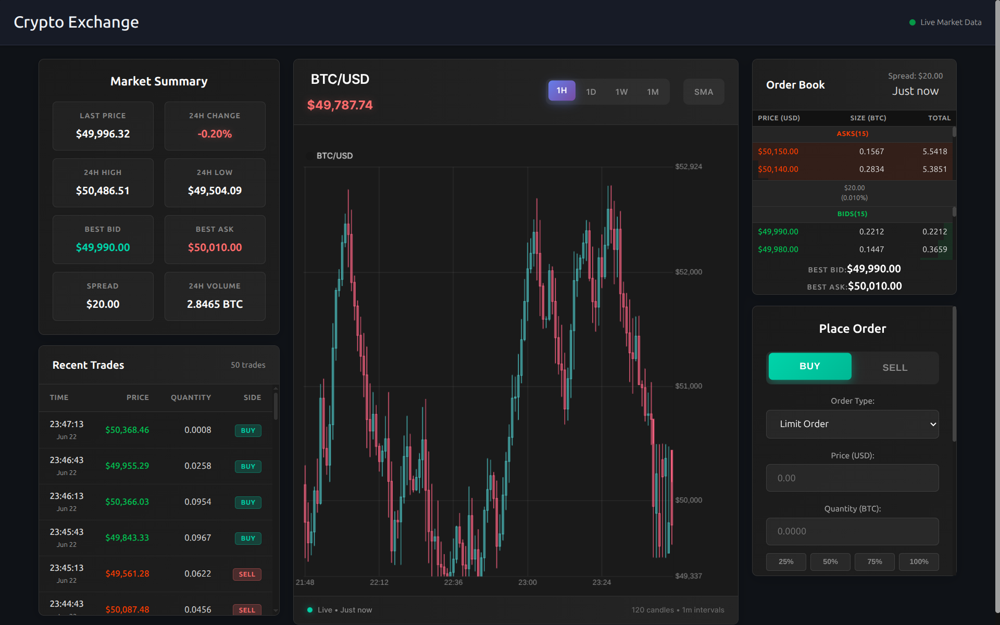

# Cryptocurrency Exchange Platform

A modern cryptocurrency trading platform with real-time market simulation, featuring interactive candlestick charts, order book visualization, and a complete trading interface. Built with React frontend and Node.js backend with realistic market data simulation.


*Live cryptocurrency exchange interface with real-time data updates*

## Current Implementation Status

**Fully Working Features:**
- Real-time candlestick chart with 1-minute intervals
- Interactive order book with live updates
- Trade history with realistic market simulation
- Order placement interface (buy/sell orders)
- Market summary with live price updates
- Professional trading UI with multiple timeframes
- Responsive design for mobile and desktop

**Real-time Updates:**
- Price data updates every 3 seconds
- Realistic market noise and volatility simulation
- Dynamic chart scaling for optimal visualization
- Live connection status indicators

## Project Structure

```
/Exchange
  /client           
    /public
    /src
      /components
        OrderForm.js                
        OrderBook.js                
        TradeHistory.js            
        PriceChart.js            
        MarketSummary.js            
      App.js                       
      App.css                      
      index.js                     
  /crypto-exchange-backend
    server.js                       
    package.json                   
  README.md                        
  media/
    test_frontend.png              # UI screenshot
```

## 🚀 Quick Start

### Prerequisites

- Node.js (v16 or higher)
- npm or yarn package manager

### Backend Setup

1. **Navigate to backend directory:**
   ```bash
   cd crypto-exchange-backend
   ```

2. **Install dependencies:**
   ```bash
   npm install express cors
   ```

3. **Start the backend server:**
   ```bash
   npm start
   ```
   Server will start on `http://localhost:3000` with the following endpoints:
   - `GET /api/v1/trades/BTC-USD` - Recent trades
   - `GET /api/v1/orderbook/BTC-USD` - Current order book
   - `POST /api/v1/order` - Place new order
   - `GET /health` - Server health check

### Frontend Setup

1. **Navigate to frontend directory:**
   ```bash
   cd client
   ```

2. **Install dependencies:**
   ```bash
   npm install
   ```

3. **Start the React development server:**
   ```bash
   npm start
   ```
   Frontend will be available at `http://localhost:3001`

## Features

### Market Data Simulation
- **Realistic Price Generation**: Multi-layered noise simulation with micro, small, medium, and large price movements
- **Dynamic Volatility**: Varying market conditions with trend bias and random walk patterns
- **Order Book Depth**: Live bid/ask spreads with realistic quantity distributions
- **Trade Flow**: Continuous trade generation with natural buy/sell distributions

### Trading Interface
- **Interactive Charts**: Candlestick charts with 1H, 1D, 1W, 1M timeframes
- **Technical Indicators**: Simple Moving Averages (SMA 9, SMA 21)
- **Order Placement**: Market and limit orders with real-time validation
- **Live Updates**: 3-second refresh cycle for all market data

### User Experience
- **Professional UI**: Dark theme with modern trading interface design
- **Responsive Design**: Optimized for desktop, tablet, and mobile devices
- **Real-time Feedback**: Live connection status and update timestamps
- **Smooth Animations**: Fluid chart updates and price change indicators

## API Endpoints

### Market Data
```javascript
// Get current order book
GET /api/v1/orderbook/BTC-USD
Response: {
  "bids": [["49500.00", "0.1234"], ...],
  "asks": [["49600.00", "0.0987"], ...]
}

// Get recent trades
GET /api/v1/trades/BTC-USD
Response: [
  {
    "tradeId": "trade_abc123",
    "price": "49550.00",
    "quantity": "0.0500",
    "side": "buy",
    "timestamp": "2024-01-15T10:30:00.000Z"
  }
]
```

### Order Management
```javascript
// Place a new order
POST /api/v1/order
Request: {
  "baseAsset": "BTC",
  "quoteAsset": "USD",
  "price": 49500,
  "quantity": 0.1,
  "side": "buy",
  "type": "limit"
}
Response: {
  "orderId": "order_xyz789",
  "status": "filled",
  "price": 49500,
  "quantity": 0.1,
  "total": "4950.00"
}
```

### Health Check
```javascript
// Server status
GET /health
Response: {
  "status": "OK",
  "timestamp": "2024-01-15T10:30:00.000Z",
  "uptime": 3600
}
```

## UI Components

### PriceChart Component
- **Technology**: Chart.js with candlestick financial charts
- **Features**: 
  - Real-time 1-minute candlestick data
  - Multiple timeframe selection (1H, 1D, 1W, 1M)
  - SMA indicators with toggle controls
  - Dynamic Y-axis scaling for optimal view
  - Professional tooltip with OHLC data
  - Smooth animations and updates

### OrderBook Component
- **Real-time bid/ask display**
- **Price level aggregation**
- **Visual depth indication**
- **Spread calculation**

### TradeHistory Component
- **Recent trades list**
- **Buy/sell side indicators**
- **Real-time trade updates**
- **Price and volume display**

### OrderForm Component
- **Buy/sell order placement**
- **Market/limit order types**
- **Input validation**
- **Balance calculations**

## 🔧 Development

### Testing the Full Stack

1. **Start both servers:**
   ```bash
   # Terminal 1: Backend
   cd crypto-exchange-backend
   npm start

   # Terminal 2: Frontend  
   cd client
   npm start
   ```

2. **Test API endpoints:**
   ```bash
   # Check server health
   curl http://localhost:3000/health

   # Get market data
   curl http://localhost:3000/api/v1/trades/BTC-USD
   curl http://localhost:3000/api/v1/orderbook/BTC-USD

   # Place a test order
   curl -X POST http://localhost:3000/api/v1/order \
     -H "Content-Type: application/json" \
     -d '{
       "baseAsset": "BTC",
       "quoteAsset": "USD", 
       "price": 49500,
       "quantity": 0.1,
       "side": "buy",
       "type": "limit"
     }'
   ```

3. **Monitor real-time updates:**
   - Open browser to `http://localhost:3001`
   - Watch live price updates every 3 seconds
   - Verify chart animation and data flow
   - Test order placement functionality

### Current Technical Stack

**Frontend:**
- React 18 with functional components and hooks
- Chart.js with financial candlestick charts
- Modern CSS with flexbox/grid layouts
- Responsive design principles

**Backend:**
- Node.js with Express framework
- RESTful API architecture
- CORS configuration for cross-origin requests
- Real-time data generation algorithms

**Data Simulation:**
- Multi-layered price noise generation
- Realistic order book simulation
- Natural trade flow patterns
- Dynamic market conditions


## 📈 Market Simulation Details

### Price Generation Algorithm
- **Base Price Range**: 45,000 - 55,000 USD (realistic BTC levels)
- **Noise Layers**: 
  - Micro movements: ±0.2%
  - Small movements: ±0.5% 
  - Medium movements: ±1.2%
  - Large movements: ±2.5% (5% probability)
- **Market Bias**: Weak trending with random walk
- **Update Frequency**: Every 3 seconds with continuous data generation

### Order Book Simulation
- **Spread Management**: Dynamic bid/ask spreads with market maker simulation
- **Depth Levels**: 25 price levels on each side
- **Quantity Distribution**: Realistic order sizes with occasional whale orders
- **Price Gaps**: Non-linear spacing with market noise

## Performance Features

- **Optimized Rendering**: Chart updates without full re-renders
- **Memory Management**: Limited dataset size (120 candles max)
- **Efficient API Calls**: Batched requests and error handling
- **Responsive Updates**: Smooth 3-second refresh cycle
- **Dynamic Scaling**: Auto-adjusting chart scales for optimal viewing


---
